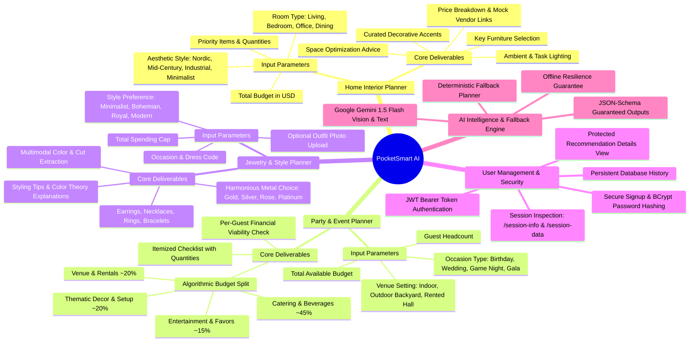

# Phase 1: Mind Map & Ideation Synthesis
## PocketSmart AI — Conceptual Architecture & Feature Mind Map

---

### 1. Conceptual Mind Map (Mermaid)

---

### 2. Ideation & Feature Brainstorming Notes

#### 2.1 Brainstorming Divergence
* **Idea 1 (Broad Shopping Assistant)**: An AI that searches every possible consumer product online.
  * *Critique*: Lacks domain depth, impossible to ensure budget adherence across random categories without deep inventory scrapers.
* **Idea 2 (Dedicated Single-Vertical Planner)**: Focus only on party planning.
  * *Critique*: Underutilizes multimodal vision capabilities; seasonal use cases limit long-term engagement.
* **Idea 3 (The PocketSmart Triad — Selected)**: Triad of high-friction, multi-item, budget-sensitive consumer workflows: **Home Interior**, **Party & Events**, and **Jewelry Matching**.
  * *Advantages*: Combines pure numeric budget division (party planning), spatial-aesthetic bundling (home interior), and multimodal computer vision (jewelry outfit analysis).

#### 2.2 Core Architectural Principles
1. **Deterministic Budget Guardrails**: LLMs are notorious for arithmetic inaccuracies. PocketSmart AI pairs the LLM with deterministic pre-allocation calculators and post-generation validator algorithms to ensure the total cost of recommended items never silently exceeds the user's hard budget limit.
2. **Transparent Provenance**: When external retail APIs are unavailable, items are explicitly labeled as `[Algorithmic Market Estimate]` with sample simulated vendor links (e.g., Target, IKEA, Blue Nile, Amazon) so users are never misled.
3. **Graceful Failover**: If the user runs without an API key or exceeds API quota, a high-fidelity local heuristic planner automatically generates rich, structured plans.

