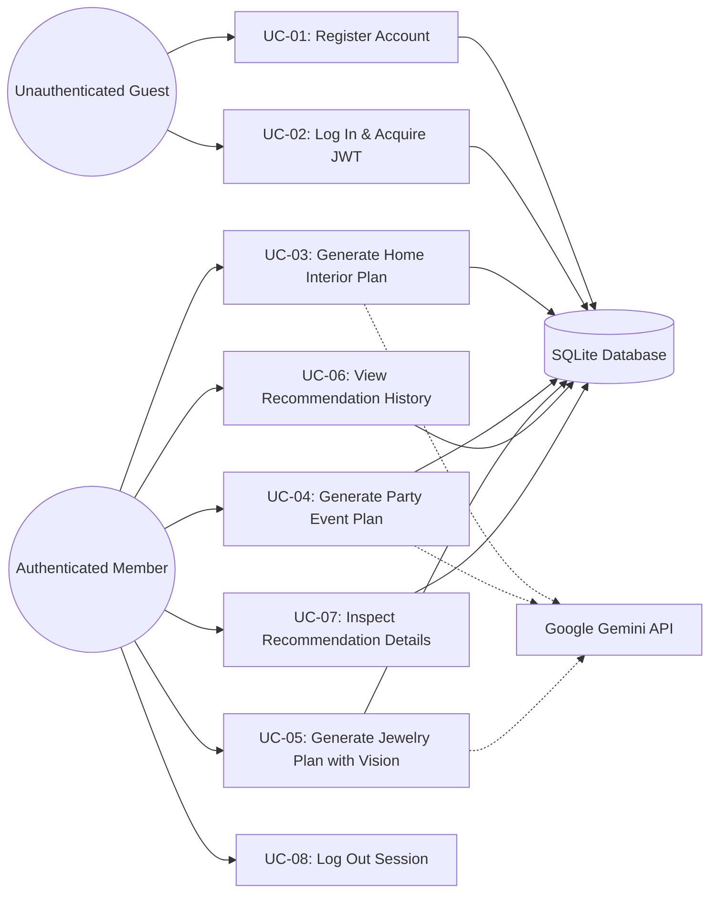

# Phase 2: Use Case Specifications
## PocketSmart AI — Actor & Use Case Detailed Models

---

### 1. Actor Catalog
1. **Unauthenticated Guest User**: Can browse the landing page, register a new account, or log in.
2. **Authenticated Member**: Can access all three planners (Home Interior, Party, Jewelry), upload outfit imagery, inspect recommendation results, export plans, and manage recommendation history.
3. **Google Gemini LLM Service**: External AI microservice providing multimodal language and vision reasoning.
4. **Local SQLite Persistence Store**: Stores user credentials, session state, and recommendation records.

---

### 2. Use Case Summary Diagram (Mermaid)

---

### 3. Detailed Use Case Specifications

#### UC-03: Generate Home Interior Plan
* **Primary Actor**: Authenticated Member.
* **Pre-conditions**: User is logged in and navigates to the Home Interior Planner view.
* **Main Success Scenario**:
  1. User enters total budget (e.g., \$2,500), selects Room Type ("Living Room"), Style ("Scandinavian Minimalist"), and priority items ("Sofa, Coffee Table, Floor Lamp, Area Rug").
  2. User clicks "Generate My Plan".
  3. Frontend sends `POST /generate-home` with bearer token and JSON body.
  4. Backend validates input ranges and budget positivity.
  5. Backend constructs structured prompt for Gemini AI including domain rules and budget caps.
  6. Gemini processes prompt and returns structured JSON of items, estimated prices, categories, and sample vendor links.
  7. Backend verifies that item sum <= budget; persists record to SQLite.
  8. Frontend renders item cards, budget allocation pie chart, and total savings.
* **Alternative Scenario 3a (AI Unavailable or No Key)**:
  * Backend catches missing key or upstream connection failure.
  * Backend triggers local heuristic fallback generator matching style and budget.
  * Result is tagged `[Algorithmic Market Estimate]` and returned smoothly.

---

#### UC-05: Generate Jewelry Plan with Vision
* **Primary Actor**: Authenticated Member.
* **Pre-conditions**: User is on the Jewelry Planner page.
* **Main Success Scenario**:
  1. User inputs occasion ("Summer Garden Wedding"), budget (\$350), style ("Delicate Floral Gold").
  2. User drags and drops an outfit image (`gown_photo.jpg`).
  3. User submits form.
  4. Frontend sends `POST /generate-jewelry` as multipart/form-data.
  5. Backend extracts image bytes, optimizes resolution via Pillow, and transmits image and text prompt to Gemini Vision.
  6. Gemini identifies color accents (e.g., pastel sage green, cowl neckline) and recommends coordinating gold leaf earrings, subtle pendant necklace, and stacked thin rings.
  7. Backend logs plan to SQLite history and returns response.
  8. Frontend presents visual recommendations with color harmony explanations.
* **Alternative Scenario 5a (No Image Uploaded)**:
  * System operates in text-only mode and formulates recommendations based on the occasion and style parameters alone.

---

#### UC-06 & UC-07: View and Inspect History
* **Primary Actor**: Authenticated Member.
* **Main Success Scenario**:
  1. User navigates to `/history`.
  2. System queries database for records matching user's ID.
  3. Displays chronological table of past plans with category badges, budget, and generated cost.
  4. User clicks "View Details" on a specific card.
  5. System retrieves full JSON via `GET /recommendations-details/{id}` and displays interactive modal/details view with option to print or export.

