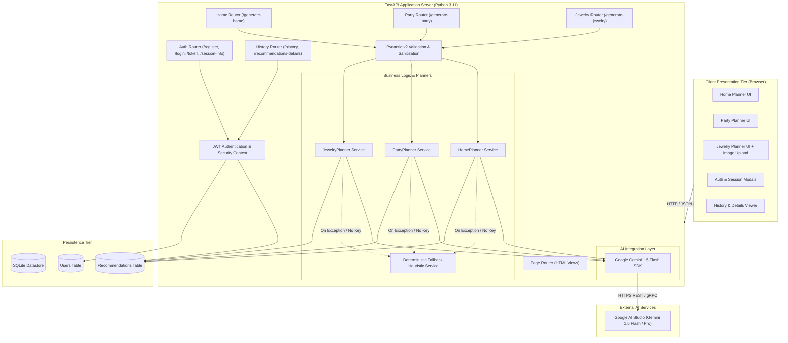

# Phase 3: System Architecture & Design
## PocketSmart AI — Architectural Blueprint & Subsystem Decomposition

---

### 1. High-Level Architectural Pattern
PocketSmart AI adopts a **Layered Modular Micro-Monolith Architecture** with clean separation of concerns:
1. **Presentation Layer**: Client browser running responsive Jinja2-rendered templates enriched with vanilla ES6+ async JavaScript, CSS Grid/Flexbox design, Chart.js for data visualization, and toast notifications.
2. **API & Routing Layer**: FastAPI asynchronous ASGI server managing route dispatching, request deserialization, CORS policies, rate limiting, and HTTP status handling.
3. **Domain & Business Logic Layer**:
   * `HomePlannerService`: Implements room budget allocation rules, furniture priority matrices, and item bundling.
   * `PartyPlannerService`: Implements per-head economics, event venue ratios, and catering allocation algorithms.
   * `JewelryPlannerService`: Implements vision-based palette extraction, metal-to-fabric harmony models, and piece coordination.
   * `MockService`: High-fidelity deterministic heuristic engine guaranteeing zero downtime when offline or without external API keys.
4. **AI & Integration Layer**: Google Gemini Generative AI Client (`google-generativeai` SDK) utilizing Gemini 1.5 Flash for language reasoning and multimodal image inspection.
5. **Persistence & Data Layer**: SQLite relational database managed via SQLAlchemy ORM with foreign key cascades, connection pooling, and indexed lookups.

---

### 2. High-Level Architecture Diagram (Mermaid)

---

### 3. Module Responsibilities

| Subsystem / Directory | Key Files | Responsibility |
| :--- | :--- | :--- |
| `backend/app/config.py` | `Settings` | Centralized Pydantic settings loading from `.env` (API keys, JWT secrets, DB path). |
| `backend/app/database.py` | `engine`, `Base`, `get_db` | SQLite connection setup, thread-safe session generator. |
| `backend/app/models.py` | `User`, `Recommendation` | SQLAlchemy database models with indexes and relationships. |
| `backend/app/schemas.py` | Pydantic Request/Response models | Enforces type contracts and validation constraints for all endpoints. |
| `backend/app/auth.py` | `create_access_token`, `get_current_user` | Bcrypt hashing, JWT generation, and dependency injection for protected routes. |
| `backend/app/services/` | `gemini_service.py`, `home_planner.py`, etc. | Core domain logic, prompt engineering, JSON schema parsing, and fallback mock generator. |
| `backend/app/routers/` | `auth_routes.py`, `planner_routes.py`, etc. | Endpoint definitions, HTTP status codes, error handling. |
| `frontend/templates/` | `base.html`, `home_planner.html`, etc. | Modular Jinja2 layouts with accessible components. |
| `frontend/static/` | CSS, JS scripts, icons | Responsive styles, client-side budget charts, and image upload handlers. |

