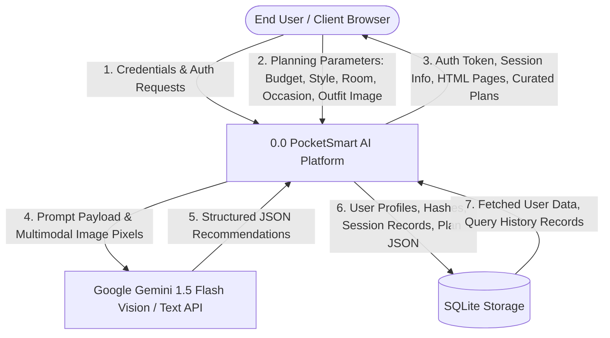
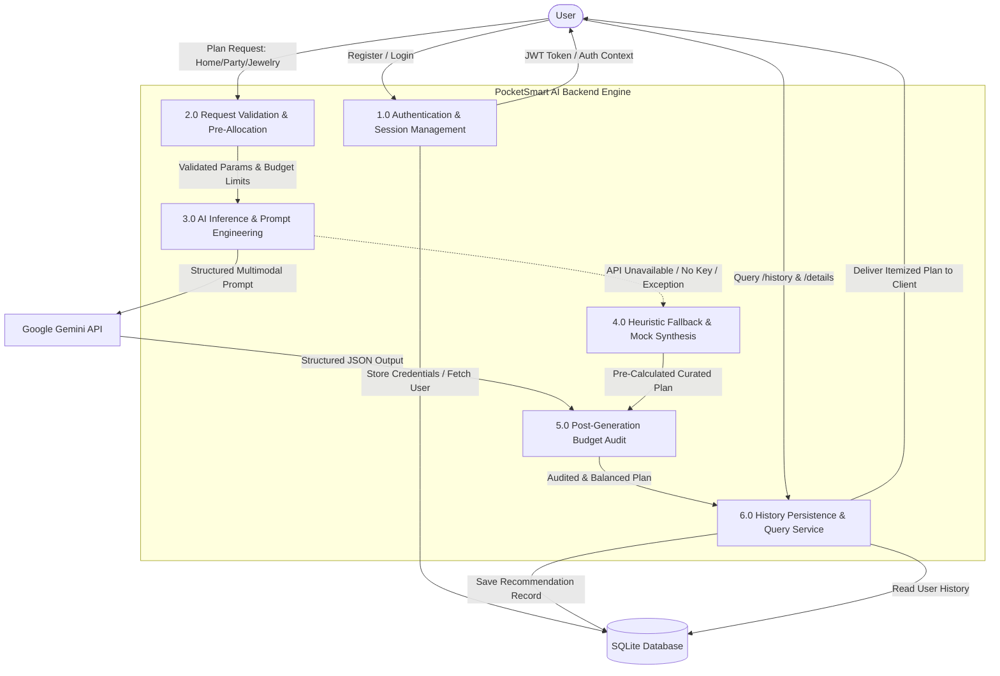
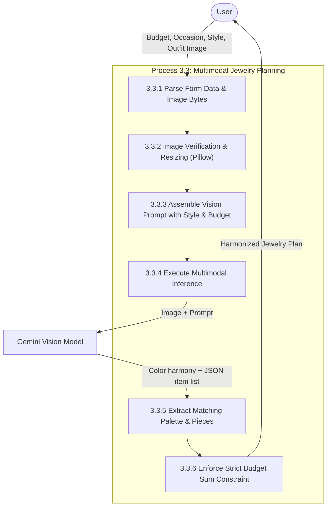

# Phase 3: Data Flow Diagrams (DFD)
## PocketSmart AI — DFD Level 0, Level 1, and Level 2 Models

---

### 1. DFD Level 0: Context Diagram

---

### 2. DFD Level 1: System Operational Decomposition

---

### 3. DFD Level 2: Jewelry Planner Multimodal Process

