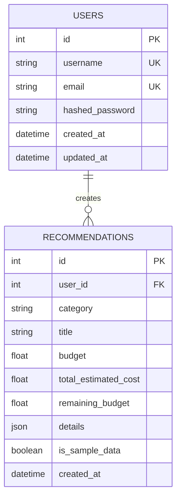

# Phase 3: Database Schema & Entity-Relationship Model
## PocketSmart AI — Relational Data Architecture

---

### 1. Entity-Relationship Diagram (Mermaid)

---

### 2. Table Specifications

#### 2.1 Table: `users`
Stores user authentication credentials, email addresses, and account metadata.

| Column | Type | Constraints | Description |
| :--- | :--- | :--- | :--- |
| `id` | `INTEGER` | `PRIMARY KEY AUTOINCREMENT` | Unique identifier for user. |
| `username` | `VARCHAR(50)` | `UNIQUE, NOT NULL, INDEX` | Unique user handle (minimum 3 characters). |
| `email` | `VARCHAR(255)` | `UNIQUE, NOT NULL, INDEX` | Unique user email address. |
| `hashed_password` | `VARCHAR(255)` | `NOT NULL` | One-way salt-hashed bcrypt password. |
| `created_at` | `DATETIME` | `DEFAULT CURRENT_TIMESTAMP` | Account creation timestamp. |
| `updated_at` | `DATETIME` | `DEFAULT CURRENT_TIMESTAMP` | Last profile update timestamp. |

#### 2.2 Table: `recommendations`
Stores curated budget plans generated by users across all three planners.

| Column | Type | Constraints | Description |
| :--- | :--- | :--- | :--- |
| `id` | `INTEGER` | `PRIMARY KEY AUTOINCREMENT` | Unique recommendation identifier. |
| `user_id` | `INTEGER` | `FOREIGN KEY(users.id) ON DELETE CASCADE, INDEX` | Owner user ID. |
| `category` | `VARCHAR(50)` | `NOT NULL, INDEX` | Domain vertical: `home`, `party`, or `jewelry`. |
| `title` | `VARCHAR(255)` | `NOT NULL` | Human-readable title of the plan. |
| `budget` | `REAL` | `NOT NULL` | User's specified budget ceiling. |
| `total_estimated_cost` | `REAL` | `NOT NULL` | Sum of all curated items/allocations. |
| `remaining_budget` | `REAL` | `NOT NULL` | Surplus / unallocated funds (`budget - total_estimated_cost`). |
| `details` | `JSON / TEXT` | `NOT NULL` | Full structured JSON payload (items, links, advice). |
| `is_sample_data` | `BOOLEAN` | `DEFAULT 0` | Flag: 1 if generated via mock/fallback heuristics; 0 if live Gemini. |
| `created_at` | `DATETIME` | `DEFAULT CURRENT_TIMESTAMP, INDEX` | Timestamp of plan generation. |

---

### 3. Data Integrity & Migration Strategy
* SQLite Foreign Key constraints are explicitly enabled via `PRAGMA foreign_keys=ON;` during database engine connection.
* Indexes are established on `users(username)`, `users(email)`, `recommendations(user_id)`, and `recommendations(category, created_at)` to guarantee constant-time queries even as historical records scale.

