# Phase 4: Work Breakdown Structure (WBS)
## PocketSmart AI — Hierarchical Project Work Breakdown

---

### 1. WBS Tree Diagram (Mermaid)

```mermaid
flowchart TD
    WBS["1.0 PocketSmart AI Project"]

    WBS --> WBS1["1.1 Ideation & Feasibility"]
    WBS1 --> WBS11["1.1.1 Problem Statement & Scope"]
    WBS1 --> WBS12["1.1.2 Multi-Dimension Feasibility Study"]
    WBS1 --> WBS13["1.1.3 Competitive Benchmarking"]

    WBS --> WBS2["1.2 Requirements Analysis"]
    WBS2 --> WBS21["1.2.1 IEEE 830 SRS Specification"]
    WBS2 --> WBS22["1.2.2 Actor & Use Case Modeling"]
    WBS2 --> WBS23["1.2.3 Agile Backlog & Epics"]

    WBS --> WBS3["1.3 Project Design"]
    WBS3 --> WBS31["1.3.1 Layered System Architecture"]
    WBS3 --> WBS32["1.3.2 DFD Levels 0, 1, and 2"]
    WBS3 --> WBS33["1.3.3 OpenAPI & JSON Schemas"]
    WBS3 --> WBS34["1.3.4 Relational Database ERD"]
    WBS3 --> WBS35["1.3.5 UI/UX Component Hierarchy"]

    WBS --> WBS4["1.4 Project Planning"]
    WBS4 --> WBS41["1.4.1 Work Breakdown Structure"]
    WBS4 --> WBS42["1.4.2 12-Week Agile Gantt Schedule"]
    WBS4 --> WBS43["1.4.3 Risk Management & Mitigation"]

    WBS --> WBS5["1.5 Engineering & Development"]
    WBS5 --> WBS51["1.5.1 FastAPI Core & Auth Subsystem"]
    WBS5 --> WBS52["1.5.2 Gemini 1.5 Multimodal Integration"]
    WBS5 --> WBS53["1.5.3 Domain Planners: Home, Party, Jewelry"]
    WBS5 --> WBS54["1.5.4 Heuristic Fallback & Mock Data Engine"]
    WBS5 --> WBS55["1.5.5 Responsive Web Frontend (Jinja2 & ES6)"]

    WBS --> WBS6["1.6 Verification & Testing"]
    WBS6 --> WBS61["1.6.1 Test Strategy & Traceability Matrix"]
    WBS6 --> WBS62["1.6.2 Automated Pytest Suite (20 Cases)"]
    WBS6 --> WBS63["1.6.3 Budget Boundary & Vision Testing"]

    WBS --> WBS7["1.7 Documentation & Thesis"]
    WBS7 --> WBS71["1.7.1 Final Academic Report / Capstone Thesis"]
    WBS7 --> WBS72["1.7.2 Interactive API Specification"]
    WBS7 --> WBS73["1.7.3 Operations & User Manual"]

    WBS --> WBS8["1.8 Project Demonstration"]
    WBS8 --> WBS81["1.8.1 Viva Presentation Slide Deck Outline"]
    WBS8 --> WBS82["1.8.2 Live Evaluation Demonstration Scripts"]
    WBS8 --> WBS83["1.8.3 Screenshot Walkthrough Guide"]
```

---

### 2. Work Package Dictionary (Summary)

* **WP-5.1 (Auth Subsystem)**: Implements registration, login, JWT token issuance, session verification endpoints (`/session-info`, `/session-data`), and password salt hashing via bcrypt.
* **WP-5.2 (AI Integration Layer)**: Implements `gemini_service.py` to communicate with Google AI Studio using Gemini 1.5 Flash, handling structured JSON output parsing and image payload packaging.
* **WP-5.3 (Domain Planners)**: Encapsulates domain budget formulas, item generation logic, and mock vendor link attachments for Home, Party, and Jewelry planners.
* **WP-5.4 (Deterministic Mock Engine)**: Provides comprehensive fallback responses with realistic prices and mock links so the platform functions 100% offline or when quota limits are met.
* **WP-5.5 (Frontend UI)**: Modern responsive Jinja2 templates, interactive CSS styling, Chart.js visualizations, and asynchronous REST clients.

