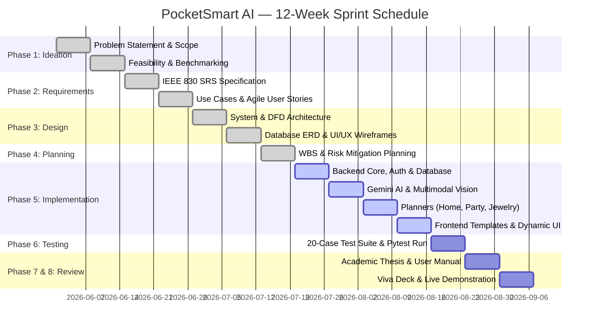

# Phase 4: 12-Week Agile Project Schedule & Gantt Chart
## PocketSmart AI — Sprint Roadmap & Delivery Timeline

---

### 1. Gantt Timeline Diagram (Mermaid)

---

### 2. Sprint-by-Sprint Milestone Table

| Sprint / Week | Phase Alignment | Major Deliverables & Milestones | Acceptance Milestone |
| :--- | :--- | :--- | :--- |
| **Week 1** | Phase 1: Ideation | Problem identification, user pain points, domain scope definition. | Milestone M1: Scope Approved |
| **Week 2** | Phase 1: Feasibility | Technical, economic, operational analysis; technology stack sign-off. | Milestone M2: Feasibility Confirmed |
| **Week 3** | Phase 2: Requirements | Draft IEEE Std 830 SRS, define functional/non-functional requirements. | Milestone M3: SRS Baseline Locked |
| **Week 4** | Phase 2: Modeling | Detailed use case specifications and Agile user story backlogs with Gherkin scenarios. | Milestone M4: Backlog Finalized |
| **Week 5** | Phase 3: Architecture | System architecture, DFD Levels 0, 1, 2, OpenAPI 3.1 contracts. | Milestone M5: Architecture Review |
| **Week 6** | Phase 3: DB & UX | Relational SQLite ERD, component design system, wireframe prototypes. | Milestone M6: Design Freeze |
| **Week 7** | Phase 4: Planning | WBS level 4 dictionary, risk register, fallback strategy definition. | Milestone M7: Execution Plan Active |
| **Week 8** | Phase 5: Core Backend | FastAPI framework initialization, JWT auth, password hashing, database models. | Milestone M8: Auth & DB Operational |
| **Week 9** | Phase 5: AI Integration | Google Gemini API integration, prompt templates, vision processing, fallback mocks. | Milestone M9: AI Pipeline Verified |
| **Week 10**| Phase 5: Web Frontend | Responsive Jinja2 views, AJAX form submissions, Chart.js graphs, session modals. | Milestone M10: Full Application Runnable |
| **Week 11**| Phase 6: Testing | 20-case test matrix execution, boundary budget checks, Pytest automated suite. | Milestone M11: 100% Tests Passing |
| **Week 12**| Phase 7 & 8: Delivery | Final Capstone Thesis/Report, User Manual, Viva Presentation Deck & Demo Scripts. | Milestone M12: Project Sign-Off |

